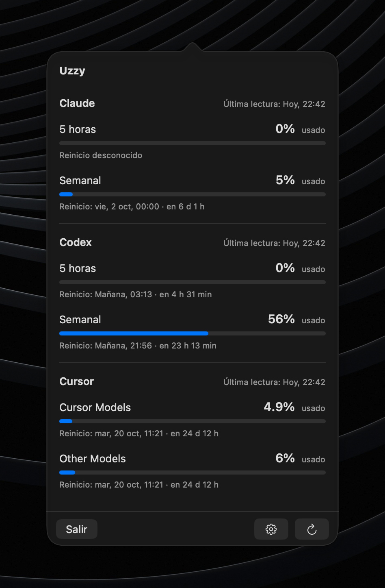
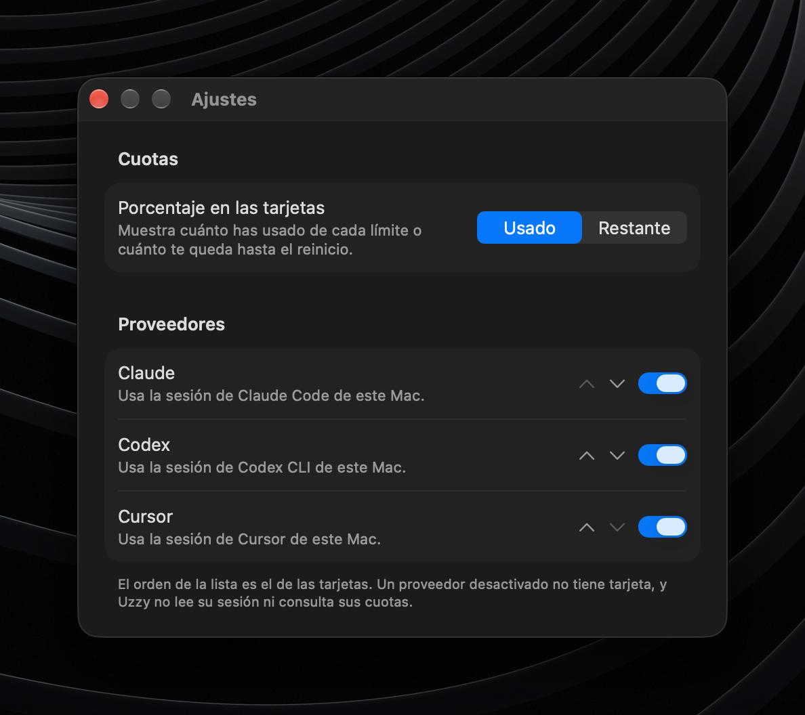

<h1 align="center">Uzzy</h1>

<p align="center">
  <strong>Your Claude, Codex and Cursor subscription quotas, one click away in the macOS menu bar.</strong><br>
  How much you have used, how much is left and when each quota resets.
</p>

<p align="center">
  
  
  
  <a href="LICENSE"></a>
</p>

<p align="center">
  
</p>

> [!NOTE]
> Uzzy is in development. The MVP is specified in [#11](https://github.com/aka-cronos/uzzy/issues/11), and there are no prebuilt releases yet: you [build it yourself](#install). The app's interface is in Spanish.

## Why Uzzy

If you pay for more than one AI coding subscription, finding out how close you are to a limit means opening each provider's dashboard. Uzzy puts every quota in one panel, reusing the sessions Claude Code, Codex CLI and Cursor already keep on your Mac. There is nothing to sign in to and no API key to paste.

## Features

- **One card per provider.** A fixed menu bar icon opens a panel with a card for each enabled provider.
- **Every quota on its own.** Each quota («5 horas», «Semanal», «Cursor Models»…) gets its own bar, its reset in local time with a countdown, and the time of its last reading. Quotas are never combined into a single percentage.
- **Queries only while you look.** Uzzy reads the quotas when you open the panel (unless the last reading is under five minutes old), every five minutes while it stays open, and on demand with the refresh button. With the panel closed it makes no requests.
- **Honest failures.** If a provider fails, its card explains why (no session, expired session, offline, incompatible response…) and the others keep working. When a refresh fails, the card keeps the last valid reading and marks it as stale. Missing data is never shown as zero.
- **Native settings.** Choose used or remaining quota, and turn each provider on or off or change the order of the cards.

<p align="center">
  
</p>

Open Settings with ⌘, from the panel; ⌘W closes it and ⌘Q quits. Your choices are remembered across launches, and a disabled provider has no card: Uzzy does not read its session or query its quotas.

## Supported providers

| Provider | Session it reuses | Quotas |
|---|---|---|
| **Claude** | Claude Code (the Keychain and `~/.claude.json`) | 5 hours, weekly, and weekly per model when the plan has them |
| **Codex** | Codex CLI signed in with ChatGPT (`~/.codex/auth.json` or `$CODEX_HOME`) | 5 hours, weekly, and any extra limit the plan has |
| **Cursor** | Cursor (its local `state.vscdb`) | «Cursor Models» and «Other Models» for the billing cycle |

The first time Uzzy reads Claude Code's session, macOS asks for access to the Keychain item.

## Privacy

- Reuses, **read-only**, the sessions that already exist in Claude Code, Codex CLI and Cursor. It never asks for passwords, signs in, refreshes tokens or writes credentials.
- Only connects to `api.anthropic.com`, `chatgpt.com` and `api2.cursor.sh`. No telemetry and no server of its own.
- Quotas live only in memory; nothing is written to disk.
- Display magnitude, provider visibility and provider order preferences are stored in local `UserDefaults`; they contain no quota, token, email or account identifier.

## Install

### Requirements

- macOS 27 on Apple Silicon.
- Xcode 27 to build.
- A signed-in session in Claude Code, Codex CLI (ChatGPT mode) and/or Cursor.

No Apple Developer account is needed: by default the app is signed ad hoc ("Sign to Run Locally"). To sign with your own team, see [Signing](CONTRIBUTING.md#signing).

### Build and install

To keep Uzzy running day to day, build it in Release and copy it to `/Applications`. From the repo root you can paste the whole block; Terminal runs the three commands in order.

```sh
# Compile a Release build into the local `build/` folder
xcodebuild build \
  -scheme Uzzy \
  -configuration Release \
  -destination 'platform=macOS,arch=arm64' \
  -derivedDataPath build

# Install the app next to the rest of your applications
cp -R build/Build/Products/Release/Uzzy.app /Applications/

# Launch the installed copy
open /Applications/Uzzy.app
```

To open it at login, add it under System Settings → General → Login Items.

## Development

### Build and test

```sh
xcodebuild test -scheme Uzzy -destination 'platform=macOS,arch=arm64'
xcodebuild build -scheme Uzzy -destination 'platform=macOS,arch=arm64' -derivedDataPath build
open build/Build/Products/Debug/Uzzy.app
```

Debug builds run as a separate app, «Uzzy Debug» (`com.akacronos.Uzzy.debug`), with an orange menu bar icon. They keep their own settings, so they can run next to the installed copy without touching it. The first time, the Debug build asks for Keychain access again.

### Debug scenarios

Debug builds add a bar on top of the panel to pick a scenario: the real panel then shows one of its states («Desactualizado», «Sin sesión», «Respuesta incompatible»…) with fictional data, without touching the accounts. The scenarios drive the usage core through the same fakes as the tests. To open the panel straight on one, pass its id (see `UzzyCore/Scenarios.swift`):

```sh
build/Build/Products/Debug/Uzzy.app/Contents/MacOS/Uzzy -scenario stale
```

Release builds leave the scenarios, the fakes and the sample responses out.

### Repository layout

| Path | Contents |
|---|---|
| `Uzzy/` | App: menu bar icon, panel and SwiftUI presentation. |
| `UzzyCore/` | Usage core: panel state, provider adapters and injectable dependencies. In Debug builds, also the fake dependencies, the sample responses and the debug scenarios. |
| `UzzyCoreTests/` | Tests through the usage core, with the fake dependencies. |
| `CONTEXT.md` | Domain vocabulary (used quota, reset, last valid reading…). |
| `Config/` | Shared build settings (signing). |
| `docs/agents/` | Agent conventions: issues, triage labels, domain docs. |
| `docs/images/` | Screenshots used in this README. |
| `.agents/skills/` | Agent skills used to work on the repo, copied from their upstream repos (see `skills-lock.json`). |

Design decisions live in the [issues](https://github.com/aka-cronos/uzzy/issues?q=is%3Aissue) of map [#1](https://github.com/aka-cronos/uzzy/issues/1).

## Contributing

See [CONTRIBUTING.md](CONTRIBUTING.md). To report a vulnerability, see [SECURITY.md](SECURITY.md).

## Disclaimer

The endpoints the app uses to read quotas are **internal and undocumented** by the providers. They may change or stop working without notice, and each person is responsible for using them within their provider's terms.

Uzzy is an independent project, not affiliated with, endorsed by or sponsored by the makers of Claude, Codex, ChatGPT or Cursor. All product names and trademarks belong to their respective owners.

## Acknowledgements

Endpoint research was informed by [OpenUsage](https://github.com/robinebers/openusage) (MIT) and [openai/codex](https://github.com/openai/codex) (Apache-2.0). No code was copied from either.

## License

[MIT](LICENSE). The agent skills under `.agents/skills/` are third-party MIT code; see [THIRD_PARTY_NOTICES.md](THIRD_PARTY_NOTICES.md).
